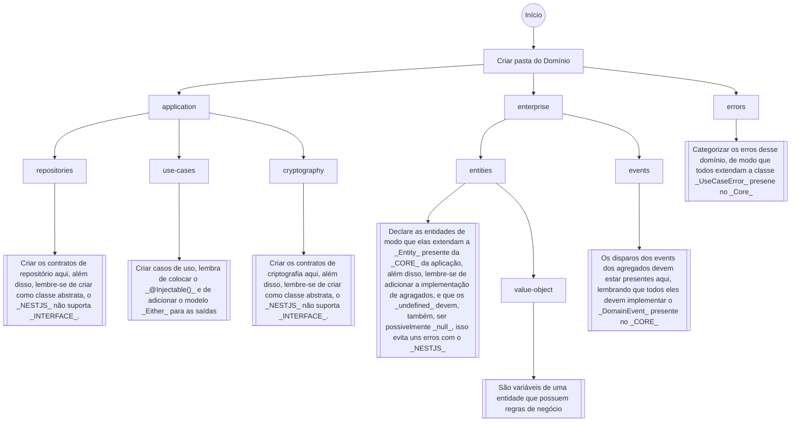
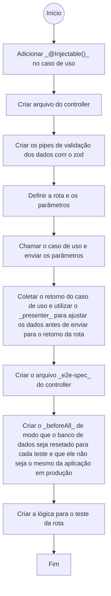

# Rocketseat_NestJS_studies
Repository with notes from Rocketseat classes regarding NestJS

## NestJS:
  * Framework opnado, ou seja, existem muitos mais receitas para fazer as coisas;
  * Semelhante ao Django no Python;
  * Perde menos tempo pensando nas decisões técnicas;

## Instalando e iniciando um projeto NestJS

1. Execute no terminal **_npm i -g @nestjs/cli_** para baixar o NestJS (a parte do global é para facilitar o uso de comandos no terminal)
2. Execute no terminal _**nest new project-name**_ para criar um novo projeto NestJS;
3. **Caso ainda não tenha sido feito**, para utilizar o **_pnpm_** é necessário executar antes **_npm install -g pnpm_**;
4. Foi utilizado o **_pnpm_** pois ele lida melhor com a memória cache (Recomendação do Diego);
5. Muitos arquivos gerados podem ser deletados, sendo assim, de maneira geral, a pasta pode ficar da seguinte forma após ser executado o comando de inicialização:
<br>📦Project-Folder
<br>┣ 📦src
<br>┃  ┣ 📜app.controller.ts
<br>┃  ┣ 📜app.module.ts
<br>┃  ┣ 📜app.service.ts
<br>┃  ┗ 📜main.ts
<br>┣ 📦test
<br>┣ 📜next-cli.json
<br>┣ 📜package.json
<br>┣ 📜pnpm-lock.yaml
<br>┣ 📜tsconfig.build.sjon
<br>┗ 📜tsconfig.json
6. _pnpm i @nestjs/config_, para realizar as configurações da variáveis de ambiente:
7. Arquivo [env.ts](./src/env.ts)

  ```JS
  // Aplicando configuração no arquivo .module
  // Essa configuração só funcionará se tiver com o arquivo "env.ts" já criado
  [ConfigModule.forRoot({
      validate: (env) => envSchema.parse(env),
      isGlobal: true, // Para as variáveis de ambiente serem acessadas por todos os módulos
    })]
  ```
  ```JS
  // Aplicando configuração no arquivo main
  // Essa configuração só funcionará se tiver com o arquivo "env.ts" já criado
    const configService = app.get<ConfigService<Env, true>>(ConfigService)
    const port = configService.get('PORT', { infer: true })
    await app.listen(port);
  ```

- Modelo base, recomendado, para o [package.json](package.json)

  ```json
  // Lembrando que os valores para as versões não necessáriamente precisam ser os mesmos, além disso, esse modelo não precisa ser seguido fielmente, é apenas uma recomendação

  {
    "name": "nestjs-test-project",
    "version": "0.0.1",
    "description": "",
    "author": "",
    "private": true,
    "license": "UNLICENSED",
    "scripts": {
      "build": "nest build",
      "format": "prettier --write \"src/**/*.ts\" \"test/**/*.ts\"",
      "start": "nest start",
      "start:dev": "nest start --watch",
      "start:debug": "nest start --debug --watch",
      "start:prod": "node dist/main",
      "lint": "eslint \"{src,apps,libs,test}/**/*.ts\" --fix",
    },
    "dependencies": {
      "@nestjs/common": "^10.0.0",
      "@nestjs/core": "^10.0.0",
      "@nestjs/platform-express": "^10.0.0",
      "reflect-metadata": "^0.2.0",
      "rxjs": "^7.8.1"
    },
    "devDependencies": {
      "@nestjs/cli": "^10.0.0",
      "@nestjs/schematics": "^10.0.0",
      "@nestjs/testing": "^10.0.0",
      "@types/express": "^5.0.0",
      "@types/node": "^20.3.1",
      "source-map-support": "^0.5.21",
      "ts-node": "^10.9.1",
      "tsconfig-paths": "^4.2.0",
      "typescript": "^5.1.3"
    }
  }
  ```

## Estrutura básica do Nest

1. Possui uma forte opnião sobre os tipos de arquivos que vamos fazer na aplicação;
  1.1 Controller → Porta de entrada via http da aplicação; - No nest, os controllers são decorados com _@Controller()_; - No caso, cada método da classe que recebeu o decorador _@Controller()_ será uma rota;
  1.2 App.Module → "Raiz" do projeto;
    - Reune tudo num lugar só;
    - Geralmente é uma classe vazia com um decorador _@module()_;
    - Controllers: Quais controllers existem dentro desse módulo (tudo que recebe requisição http);
    - As entradas do decorador são:
      - providers: Quais as dependências dos controllers (basicamente é tudo que não é controller);
    - Para que seja possível passar um _provider_, a classe que é passada precisa, obrigatoriamente, ter um decorador _@injectable()_;
---
## Docker

1. Download do [Docker-Desktop](https://desktop.docker.com/win/main/arm64/Docker%20Desktop%20Installer.exe?utm_source=docker&utm_medium=webreferral&utm_campaign=dd-smartbutton&utm_location=module&_gl=1*qn6m94*_gcl_au*NzY5OTQxNTk1LjE3MzEwNzU1NTY.*_ga*MTY0Njg4OTY5MS4xNzI5NjE4NDMx*_ga_XJWPQMJYHQ*MTczMTA3NDIxMS4zLjEuMTczMTA3NTU1Ny41OS4wLjA.)
2. Download da imagem [Postgres]() para o docker
3. Docker não funcionou de primeira, sendo assim eu tentei os seguintes comando e um deles ou o conjunto resolveu:
      ```ps1
      wsl --install
      ```
      ```ps1
      wsl --list --online
      ```
      ```ps1
      wsl --install -d Ubuntu-FOUNDED_VERSION
      ```
      ```ps1
      bcedit /set hypervisorlaunchtype auto
      ```
    > Desmarcar a opção de WSL que está presente na hora de instalação do Docker Desktop;
    
    > Alterar a opção de "Virtualização" na BIOS da placa mãe;

#### Exemplo do docker-compose.yml

- Se der erro, deleta a parte do volume, tentei um monte de coisa que achei no git e com o GPT, mas sempre caia num erro de permissão da pasta, e como Diego falou que não é tão necessário assim para desenvolvimento, eu só deixei sem.
```yml
version: "123.45"

services:
  postgres:
    container_name: nome-do-container
    image: nome-da-imagem
    ports: -5432:5432
    environment:
      POSTGRES_USER: postgres_user
      POSTGRES_PASSWORD: postgres_user_password
      POSTGRES_DB: bd_name
      PGDATA: /path/to/bd/folder
    volumes:
      - ./data/pg:/path/to/bd/folder
```

###### Docker comands

- Start:

```ps1
docker-compose up -d
```

- End:

```ps1
docker-compose down -v
```

- Check:

```ps1
docker ps -a
```

- Infos:

```ps1
docker logs container_name
```
---
## Prisma

###### Start

    pnpm i prisma -D
    pnpm i @prisma/client
    pnpm prisma init

###### Commum Commands

    pnpm prisma migrate dev
    pnpm prisma studio
---
## BCripytJS
- É basicamente para utilizar os comandos _hash_ e _compare_

###### Commum Commands
```ps1
pnpm i bcryptjs
```
```ps1
pnpm i @types/bcryptjs -D
```
```javascript
hash(stringToHash, numberOfInteractions)
```
```javascript
compare(password, user.password)
```
---

## AuthModule

- Bibliotecas necessárias:
  ```ps1
  pnpm i @nestjs/passport @nestjs/jwt passport-jwt @types/passport-jwt
  ```
- JWT -> JSON Web Token

- Algorítmo RS256
  - O _secret_ será composto por duas chaves, uma pública e uma privada;
  - A chave privada é utilizada para criação e validação de tokens e fica armazenada **apenas** no serviço que cria novas autentificações;
  - A chave pública pode está em todos so serviços que precisam validar os tokens, porém não serve para criar novas autentificações;
  - Para gerar as chaves existem diversos métodos, porém o mais rápido provavelmente é entrar num site e gerar;
  - As chaves geradas estarão em formato de string, e muito provavelmente terá quebra de linhas, então tem que mudar para base64 para colocar no arquivo .env

- Os arquivos da pasta [auth](./src/auth/)
  - Eles são fixos, digo no sentido de que provavelmente não terão mudanças, são linhas de códigos feita por meio da documentação do NestJS, então creio que se por lá não alterar, muito provavelmente esse código também não será alterado;
---
## Configurando o Vitest

- Comandos iniciais:

```ps1
pnpm i vitest unplugin-swc @swc/core @vitest/coverage-v8 -D
```
```ps1
pnpm i vite-tsconfig-paths -D
```
```ps1
pnpm i supertest -D
```
```ps1
pnpm i @types/supertest -D
```

- Arquivo [vitest.config.ts](./vitest.config.ts) é padrão do NestJS

- Ajustando os scripts de teste no package.json:

  ```json
  {
    "type": "module",

  }
  // ...
  {
    "scripts": {
      "test": "vitest run",
      "test:watch": "vitest",
      "test:cov": "vitest run --coverage",
      "test:debug": "vitest --inspect-brk --inspect --logHeapUsage --threads=false",
      "test:e2e": "vitest run --config ./vitest.config.e2e.ts"
    }
  }
  ```

- [setup-e2e.ts](./test/setup-e2e.ts) é basicamente um arquivo que garante que o banco de dados seja um ambiente isolado para os testes;
---
## Copiando os arquivos de um Dominínio

1. Baixar as dependências da camada de domínio;
2. Insira a pasta completa do domínio na pasta [domain](./src/domain/); 
3. Faça uma verificação do TypeScript para garantir que todas as bibliotecas necessárias para a execução do domínio tenham sido baixadas.
   - Código capaz de fazer uma "verificação" rápida do TypeScript:
    ```ps1
    pnpm tsc --noEmit
    ```
4. Execute os testes unitários da camada de domínio, e em seguida resolva, caso ocorra, os problemas encontrados antes de dar continuidade;
    - Caso surja um erro com o _SpyInstance_, que é utilizado pelo Diego, ocorre que nas novas verções do Vitest, o _SpyInstance_ foi substituido por _MockInstance_, os demais problemas de TypeScript foram resolvidos jogando no GPT;
---
## Mappers:

Os mappers são responsáveis por converter uma entidade de um formato para outro, permitindo que diferentes camadas da aplicação trabalhem com representações diferentes da mesma entidade

---
## Presenter:

Os presenters são responsáveis por converter informações de modo que elas sejam melhores lidas pelo front end, ou até mesmo filtrar informações da saída dos controllers;

---

### Ideia geral para organizão de pasta após a cópia do domínio:

<br>📦src
<br> ┣ 📂core
<br> ┃ ┣ 📂entities // Contratos base para as entidades
<br> ┃ ┃ ┣ 📜aggregate-root.ts
<br> ┃ ┃ ┣ 📜entity.ts
<br> ┃ ┃ ┣ 📜unique-entity-id.ts
<br> ┃ ┃ ┣ 📜watched-list.spec.ts
<br> ┃ ┃ ┗ 📜watched-list.ts
<br> ┃ ┣ 📂errors
<br> ┃ ┃ ┣ 📂errors // Erros definidos para a aplicação
<br> ┃ ┃ ┃ ┣ 📜not-allowed-error.ts
<br> ┃ ┃ ┃ ┗ 📜resource-not-found-error.ts
<br> ┃ ┃ ┗ 📜use-case-error.ts
<br> ┃ ┣ 📂events // Eventos de domínio (Aula de notificações)
<br> ┃ ┃ ┣ 📜domain-event.ts
<br> ┃ ┃ ┣ 📜domain-events.spec.ts
<br> ┃ ┃ ┣ 📜domain-events.ts
<br> ┃ ┃ ┗ 📜event-handler.ts
<br> ┃ ┣ 📂repositories
<br> ┃ ┃ ┗ 📜pagination-params.ts
<br> ┃ ┣ 📂types // Só copia
<br> ┃ ┃ ┗ 📜optional.ts
<br> ┃ ┣ 📜either.spec.ts
<br> ┃ ┗ 📜either.ts // Só copia
<br> ┣ 📂domain // Pasta onde ficam os domínio
<br> ┃ ┣ 📂Example-Domain
<br> ┃ ┃ ┣ 📂application
<br> ┃ ┃ ┃ ┣ 📂repositories
<br> ┃ ┃ ┃ ┃ ┗ 📜example-repository.ts
<br> ┃ ┃ ┃ ┗ 📂use-cases
<br> ┃ ┃ ┃ ┃ ┗ 📜example-use-case.ts
<br> ┃ ┃ ┗ 📂enterprise
<br> ┃ ┃ ┃ ┣ 📂entities
<br> ┃ ┃ ┃ ┃ ┣ 📂value-objects // Informações de uma entidade que são objetos e possuem algum tipo de validação ou operação
<br> ┃ ┃ ┃ ┃ ┃ ┗ 📜example-value-object.ts
<br> ┃ ┃ ┃ ┃ ┗ 📜example-entity.ts
<br> ┃ ┃ ┃ ┗ 📂events
<br> ┃ ┃ ┃ ┃ ┗ 📜example-event-from-this-domain.ts
<br> ┃ ┗ 📂notification // Vai ter em praticamente toda aplicação
<br> ┃ ┃ ┣ 📂application
<br> ┃ ┃ ┃ ┣ 📂repositories
<br> ┃ ┃ ┃ ┃ ┗ 📜notifications-repository.ts
<br> ┃ ┃ ┃ ┣ 📂subscribers // Basicamente são os acionadores de um determinado evento
<br> ┃ ┃ ┃ ┃ ┗ 📜example-on-event-trigger.ts
<br> ┃ ┃ ┃ ┗ 📂use-cases
<br> ┃ ┃ ┃ ┃ ┣ 📜read-notification.spec.ts
<br> ┃ ┃ ┃ ┃ ┣ 📜read-notification.ts
<br> ┃ ┃ ┃ ┃ ┣ 📜send-notification.spec.ts
<br> ┃ ┃ ┃ ┃ ┗ 📜send-notification.ts
<br> ┃ ┃ ┗ 📂enterprise
<br> ┃ ┃ ┃ ┗ 📂entities
<br> ┃ ┃ ┃ ┃ ┗ 📜notification.ts
<br> ┗ 📂infra
<br> ┃ ┣ 📂auth // Só copia, não tem muito o que entender aqui, é da documentação do NestJS
<br> ┃ ┃ ┣ 📜auth.module.ts
<br> ┃ ┃ ┣ 📜current-user-decorator.ts
<br> ┃ ┃ ┗ 📜jwt.strategy.ts
<br> ┃ ┣ 📂database // Coloca as paradas do banco de dados aqui
<br> ┃ ┃ ┣ 📂banco-de-dados-escolhido
<br> ┃ ┃ ┃ ┣ 📂mappers // Converte formato-entidade<=> formato-banco-de-dados
<br> ┃ ┃ ┃ ┃ ┗ 📜example-mapper.ts
<br> ┃ ┃ ┃ ┣ 📂repositories // repositórios do banco de dados
<br> ┃ ┃ ┃ ┃ ┗ 📜example-repository.ts
<br> ┃ ┃ ┃ ┗ 📜database.service.ts
<br> ┃ ┃ ┗ 📜database.module.ts
<br> ┃ ┣ 📂http
<br> ┃ ┃ ┣ 📂controllers // Controllers do Nest
<br> ┃ ┃ ┃ ┣ 📜authentificate.controller.e2e-spec.ts
<br> ┃ ┃ ┃ ┣ 📜authentificate.controller.ts
<br> ┃ ┃ ┃ ┣ 📜example.controller.e2e-spec.ts
<br> ┃ ┃ ┃ ┗ 📜example.controller.ts
<br> ┃ ┃ ┣ 📂pipes
<br> ┃ ┃ ┃ ┗ 📜zod-validation-pipe.ts // Veja [create-question.controller.ts](./src/infra/http/controllers/create-question.controller.ts) para exemplo do uso dessa validação
<br> ┃ ┃ ┗ 📜http.module.ts
<br> ┃ ┣ 📜app.module.ts
<br> ┃ ┣ 📜env.ts
<br> ┃ ┗ 📜main.ts

<br>📦test
<br> ┣ 📂factories
<br> ┃ ┗ 📜factory-example.ts
<br> ┣ 📂repositories
<br> ┃ ┗ 📜example-test-repository.ts
<br> ┣ 📂utils
<br> ┃ ┗ 📜wait-for.ts // Só copia
<br> ┗ 📜setup-e2e.ts

---

## Gateway de criptografia

- Responsável por gerenciar a comunicação entre os casos de uso (domínio) e o códulo de criptografia (infra/http);
- Ficará salvo dentro do domínio;
- Receberá um _payload_, ou seja, o que deseja incluir dentro do token

---

## Stubs de Criptografia

- Stub -> Uma classe que implementa um contrato, porém a implementação é fictícia, feita apenas para teste;

---

## Upload de arquivos

- O NestJS, se utilizando o express que é o nativo, utiliza o multer para lidar com o download de arquivos;
- Rapaz, pelo que entendi é um modelo definido do Nest, como ele é uma framework opnado, acho que não vai ser muito diferente disso por um tempo;
- 
```ps1
pnpm i -D @types/multer
```


---
## Estrutura da camada de domínio:


## Criando controllers:

